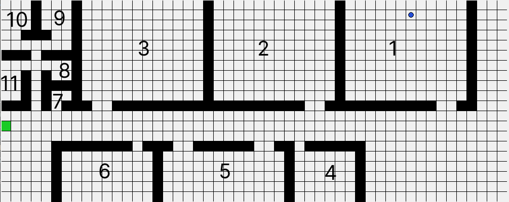
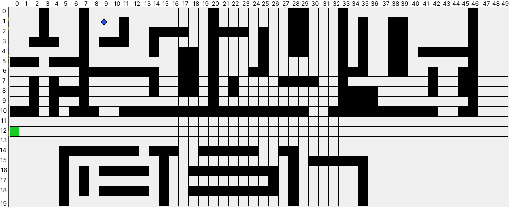

# Evacuation-route-Q-learning-gedung-DC
Ini adalah program untuk membuat jalur evakuasi pada gedung Digital Center UNNES lantai 1 dengan menggunakan Q-learning. Environment dibuat versi grid dengan ukurang 50x20 grid. Terdapat dua jenis environment yaitu environment dengan obstacle tambahan dan environment tanpa obstacle tambahan. Adapun gambar dari masing-masing encironment dapat dilihat di bawah.

### 1. Gambar Enviroment Tanpa Obstacle Tambahan

### 2. Gambar Environment Dengan Obstacle Tambahan

Agent pada kedua environment bisa dipindah ke posisi manapun. Contoh hasil training agent bisa dilihat pada gambar di bawah. Adapun hasil lengkap bisa dilihat pada folder `Result`
### 1. Pada environment tanpa obstacle tambahan

### 2. Pada ruang dengan obstacle tambahan

Untuk menjalankan program, jalankan terlebih dahulu perintah `pip install requirements.txt` untuk menginstall semua library yang dibutuhkan.
